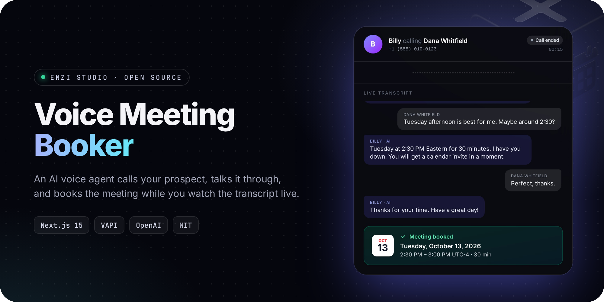
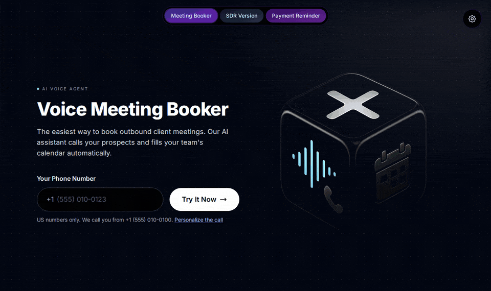
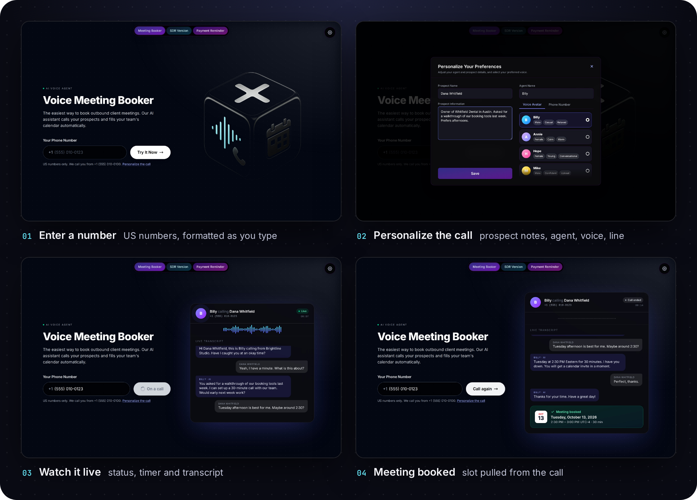
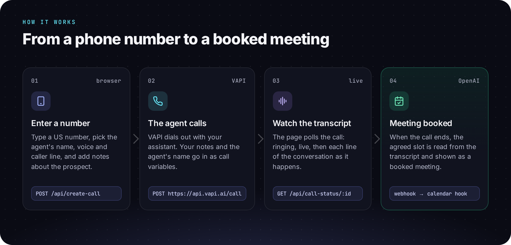

<p align="center">
  
</p>

<p align="center">
  <a href="https://enzihub.github.io/voice-meeting-booker/"><b>Website</b></a> ·
  <a href="#quick-start">Quick start</a> ·
  <a href="#how-it-works">How it works</a> ·
  <a href="#configuration">Configuration</a>
</p>

<p align="center">
  
  
  
  
  
  
</p>

Type a phone number and an AI voice agent calls it, has the conversation, and books the meeting. You watch the call live in the browser: ringing, the transcript line by line, then the slot the customer agreed to.

The same app runs three agents: a **meeting booker**, an **AI SDR** that qualifies leads and books demos, and a **payment reminder** for overdue invoices.

<p align="center">
  
</p>
<p align="center"><sub>Recorded from the real app running locally. VAPI is replaced by the bundled fake (<code>npm run demo</code>), so the people and phone numbers are invented.</sub></p>

## Features

<p align="center">
  
</p>

- **One-click outbound calls.** Enter a US number and the agent dials it through VAPI.
- **Live call view.** A call card shows who is calling whom, the status (queued, ringing, live, ended), a timer, a waveform and the transcript as it happens.
- **Meeting booked, not just a recording.** When the call ends, the page shows the agreed slot as a calendar card. The slot comes from VAPI's structured data, or OpenAI reads it out of the transcript.
- **Brief the agent first.** Give the prospect's name and notes, rename the agent, pick a voice persona and a caller line. These go to VAPI as assistant overrides and call variables.
- **Three agents, one codebase.** `/`, `/sdr` and `/reminder` each use their own VAPI assistant and copy, and share everything else.
- **Webhook for your calendar.** `POST /api/webhooks/vapi-call` handles VAPI's end-of-call report and gives you the slot, ready for a calendar integration.
- **Runs with no accounts.** `npm run demo` starts a tiny fake of the VAPI API, so you can try the whole flow without keys or real phone calls.

## How it works

<p align="center">
  
</p>

1. The browser posts the number, notes and chosen voice to `POST /api/create-call`.
2. The server calls `POST https://api.vapi.ai/call` with your assistant id and phone-number id. Notes and the agent's name go in as `variableValues`.
3. The page polls `GET /api/call-status/:id`, which reads the call from VAPI and returns its status and transcript.
4. When the call ends, the agreed slot comes from `analysis.structuredData` (if your assistant defines it) or from OpenAI reading the customer's side of the transcript.

## Quick start

You need Node.js 20 or newer.

```bash
git clone https://github.com/enzihub/voice-meeting-booker
cd voice-meeting-booker
npm install

# Try it with no accounts: fake VAPI + the app on http://127.0.0.1:3000
npm run demo
```

Type any 10-digit number (for example `555 010 0123`) and press **Try It Now**. The fake plays back a scripted call.

For real calls:

```bash
cp .env.example .env.local   # fill in your VAPI and OpenAI keys
npm run dev
```

In VAPI, create an assistant per mode (or one shared assistant), buy or import a phone number, and set the assistant's Server URL to `https://<your-host>/api/webhooks/vapi-call` if you want the webhook.

## Configuration

Every value is read from the environment and is blank by default. See [`.env.example`](.env.example).

| Variable | Required | What it is for |
| --- | --- | --- |
| `VAPI_API_KEY` | yes | Your VAPI private key. |
| `VAPI_ASSISTANT_ID` | yes* | Fallback assistant for every mode. |
| `VAPI_ASSISTANT_ID_MEETING_BOOKER`, `VAPI_ASSISTANT_ID_SDR`, `VAPI_ASSISTANT_ID_REMINDER` | yes* | One assistant per mode. *Set these or the fallback. |
| `VAPI_PHONE_NUMBER_ID` | yes | The VAPI phone number the agent calls from. |
| `VAPI_PHONE_NUMBERS` | no | JSON list of caller lines for Settings: `[{"phone_id":"…","number":"+1 (555) 010-0100","label":"Main Office"}]` |
| `VAPI_VOICES` | no | JSON list of voices for Settings: `[{"voice_id":"<11labs id>","voicename":"Billy","preview_audio":"","tags":["Male"],"default":true}]` |
| `VAPI_WEBHOOK_SECRET` | no | If set, the webhook requires a matching `x-vapi-secret` header. |
| `VAPI_BASE_URL` | no | Override the VAPI API base. The demo uses it to point at the local fake. |
| `OPENAI_API_KEY` | no | Reads the agreed slot from the transcript when VAPI gives no structured data. |
| `OPENAI_MODEL` | no | Defaults to `gpt-4o-mini`. |
| `BOOKING_TIMEZONE` | no | Time zone the model assumes for relative times. Defaults to `America/New_York`. |

Without `VAPI_VOICES` the Settings panel shows generic personas and the call uses your assistant's own voice. Without `VAPI_PHONE_NUMBERS` it shows fictional 555 numbers and calls from `VAPI_PHONE_NUMBER_ID`.

## Project structure

```
app/
  page.tsx, sdr/, reminder/       one page per agent mode
  api/create-call/                start a VAPI call
  api/call-status/[id]/           status + transcript + booked slot
  api/webhooks/vapi-call/         VAPI end-of-call webhook
  api/config/                     voices and caller lines for Settings
components/                       AgentScreen, LiveCallPanel, SettingsModal, NavBar
lib/config.ts                     env-driven configuration
lib/extract-slot.ts               transcript parsing and OpenAI slot extraction
scripts/fake-vapi.mjs             local fake of the VAPI API for the demo
docs/                             the project website (GitHub Pages)
```

## Status

Built by Enzi Studio in 2025 as a prototype and shared as is. It is not maintained as a product. The calendar booking step is left as an integration point in the webhook: the app shows the agreed slot but does not write to a calendar. The phone input accepts US numbers only.

For this release the code was tidied up: account-specific ids, phone numbers and storage links were moved to environment variables, the three near-identical pages were merged into one component, and the live call view and local demo were added.

## Credits

Built by [Enzi Studio](https://github.com/enzihub). Contributors to the original prototype: [@bb-xops](https://github.com/bb-xops), [@sun2ii](https://github.com/sun2ii) and [@harrythentrepreneur](https://github.com/harrythentrepreneur).

Voice calls by [VAPI](https://vapi.ai). Inter typeface by Rasmus Andersson (SIL Open Font License), via Fontsource.

## Licence

[MIT](LICENSE) © 2025-2026 Enzi Studio (Harry Edwards)
